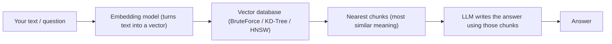

# Start Here — Learn AI, Vectors, and RAG from Zero

Welcome. This folder teaches you **everything this project does**, in plain language, one idea
at a time. You do not need any AI background. If you can read Java and understand "a list of
numbers", you can follow all of it.

## The one-sentence summary

> This project turns text into lists of numbers (**vectors**), stores them in a **vector
> database**, finds the "closest" ones to your question, and hands those to a local AI model to
> write an answer. That last part — retrieve, then generate — is called **RAG**.

## The big picture



## Recommended reading order

Each file follows the same simple shape: **What it is → Why it exists → How it works here →
How to remember it → Where it shows up in real life / interviews.**

1. [01-what-is-a-vector.md](01-what-is-a-vector.md) — the "list of numbers" idea
2. [02-embeddings.md](02-embeddings.md) — how text becomes a vector
3. [03-distance-metrics.md](03-distance-metrics.md) — measuring "closeness"
4. [04-bruteforce.md](04-bruteforce.md) — the simplest search
5. [05-kdtree.md](05-kdtree.md) — a smarter tree-based search
6. [06-hnsw.md](06-hnsw.md) — the algorithm real vector DBs use
7. [07-what-is-rag.md](07-what-is-rag.md) — retrieve + generate
8. [08-llms-and-ollama.md](08-llms-and-ollama.md) — the AI model and how we run it locally
9. [09-chunking.md](09-chunking.md) — splitting documents well
10. [10-evaluation-recall-at-k.md](10-evaluation-recall-at-k.md) — proving it actually works
11. [11-real-world-and-interview-mapping.md](11-real-world-and-interview-mapping.md) — where this
    maps to Pinecone/Weaviate and interview questions
12. [glossary.md](glossary.md) — every term in one place

## How to run it

See the project [README](../README.md) for macOS setup. Short version:

```bash
brew install openjdk@21 maven ollama
ollama pull nomic-embed-text && ollama pull llama3.2:1b
ollama serve            # in one terminal
./run.sh                # in another; open http://localhost:8081
```

## Where the code lives (so you can jump in)

| Concept | File |
|---|---|
| Distance metrics | `src/main/java/com/learn/vectordb/distance/DistanceMetric.java` |
| Brute force | `src/main/java/com/learn/vectordb/index/BruteForceIndex.java` |
| KD-Tree | `src/main/java/com/learn/vectordb/index/KdTreeIndex.java` |
| HNSW | `src/main/java/com/learn/vectordb/index/HnswIndex.java` |
| Ollama client | `src/main/java/com/learn/vectordb/embedding/OllamaClient.java` |
| RAG pipeline | `src/main/java/com/learn/vectordb/rag/RagService.java` |
| Chunking | `src/main/java/com/learn/vectordb/rag/TextChunker.java` |
| Evaluation | `src/main/java/com/learn/vectordb/eval/EvaluationService.java` |
