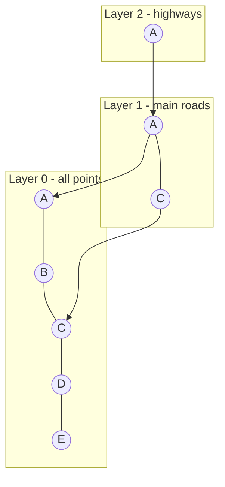

# 6. HNSW — Hierarchical Navigable Small World

This is the star of the show: the algorithm powering Pinecone, Weaviate, Chroma, Milvus, and
FAISS's `IndexHNSW`.

## What it is (simple analogy)

Imagine navigating a country:

- **Top layer = highways** — few cities, long roads. You cover huge distances fast.
- **Middle layers = main roads.**
- **Bottom layer (layer 0) = every little street** — every point, densely connected.

To find a destination you start on the highway, get to the right region quickly, then drop down
layer by layer to local streets for the precise address. That is HNSW: a **multi-layer graph**
where upper layers are sparse "express lanes" and layer 0 has everything.



## Why it exists

It gives roughly **O(log N)** search that stays accurate **even in high dimensions**, where
KD-Trees collapse. It is **approximate** (it may occasionally miss a true neighbor) but in
practice recall is 95%+ while being orders of magnitude faster than brute force.

## How it works here (the key parameters)

Constructed with these knobs:

```62:73:src/main/java/com/learn/vectordb/index/HnswIndex.java
    public HnswIndex(int m, int efConstruction) {
        this.m = m;
        this.m0 = 2 * m;
        this.efConstruction = efConstruction;
        this.mL = 1.0 / Math.log(m);
        // Fixed seed keeps graph construction deterministic (helpful for tests).
        this.rng = new Random(42);
    }
```

- **M (16):** how many neighbor links each node keeps on upper layers. Higher M = better recall,
  more memory.
- **M0 (2·M):** more links on the dense bottom layer.
- **efConstruction (200):** how hard we search while *building* — bigger = better graph, slower
  build.
- **ef (search-time, 50):** how wide we search while *querying* — bigger = better recall,
  slower query. This is the main dial you tune in production.
- **mL:** controls how tall the layer pyramid grows.

**Insert:** pick a random top level for the node, greedily descend from the entry point to that
level, then at each level down to 0 connect to the M nearest neighbors (bidirectionally), pruning
over-full neighbor lists. See `insert(...)`.

**Search:** greedy descent through upper layers (ef=1), then a wider beam search (ef) at layer 0.
See `knn(...)`.

## How to remember it

> **HNSW = highways over streets. Skim the top to reach the neighborhood, zoom in at the bottom.
> Approximate but fast, and it survives high dimensions.**

Dial to remember: **bigger `ef` → more accurate, slower.**

## Where it shows up in real life / interviews

- It is the default index in essentially every modern vector database.
- Interview questions you can now answer:
  - *"How does a vector DB search millions of vectors in milliseconds?"* → HNSW's layered graph,
    O(log N)-ish.
  - *"What's the accuracy/speed knob?"* → `ef` at query time (and M/efConstruction at build).
  - *"Why not KD-Tree?"* → curse of dimensionality (see doc 5).
- Our evaluation harness (doc 10) measures HNSW's recall against brute force so you can *see* the
  approximate-but-high-recall behavior for real.
