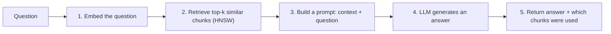

# 7. What Is RAG? (Retrieval-Augmented Generation)

## What it is (simple analogy)

**RAG = open-book exam for an AI.**

A plain LLM answers from memory (what it learned during training). That memory is frozen, can be
out of date, and knows nothing about *your* private documents — so it sometimes confidently makes
things up ("hallucinates").

RAG lets the model **look things up first**: we find the most relevant snippets from your
documents and hand them to the model along with the question. The model then answers using that
fresh, specific context. Open book, not from memory.

## Why it exists

- **Private/fresh knowledge:** answer questions about *your* PDFs, notes, wiki — data the model
  was never trained on.
- **Fewer hallucinations:** grounded in real retrieved text.
- **Cheaper than retraining:** you don't fine-tune the model; you just feed it context.

## How it works here — the 5 steps



All five live in one readable method:

```76:99:src/main/java/com/learn/vectordb/rag/RagService.java
    public RagResponse ask(String question, int k) {
        float[] queryEmbedding = ollama.embed(question);
        if (queryEmbedding.length == 0) {
            throw new OllamaUnavailableException("Ollama unavailable");
        }

        List<Map.Entry<Float, DocChunk>> hits = documentStore.search(queryEmbedding, k);
```

We also return the exact chunks used (the UI shows them as clickable "context chips") so the
answer is **transparent** — you can verify where it came from.

## How to remember it

> **RAG = Retrieve, then Generate. Give the AI the right pages before asking the question.**

## Where it shows up in real life / interviews

- Chat-with-your-docs, customer-support bots, internal knowledge assistants, coding assistants
  over a codebase — nearly all are RAG.
- Interview talking points:
  - *"How do you stop an LLM from hallucinating about company data?"* → RAG with grounding +
    return sources.
  - *"RAG vs fine-tuning?"* → RAG adds *knowledge* cheaply and updates instantly; fine-tuning
    changes *behavior/style* and is costly. Often you use both.
  - Know the failure modes: bad chunking, wrong `k`, retrieval misses → the model can't answer
    well no matter how good it is. "Garbage retrieved, garbage generated."
